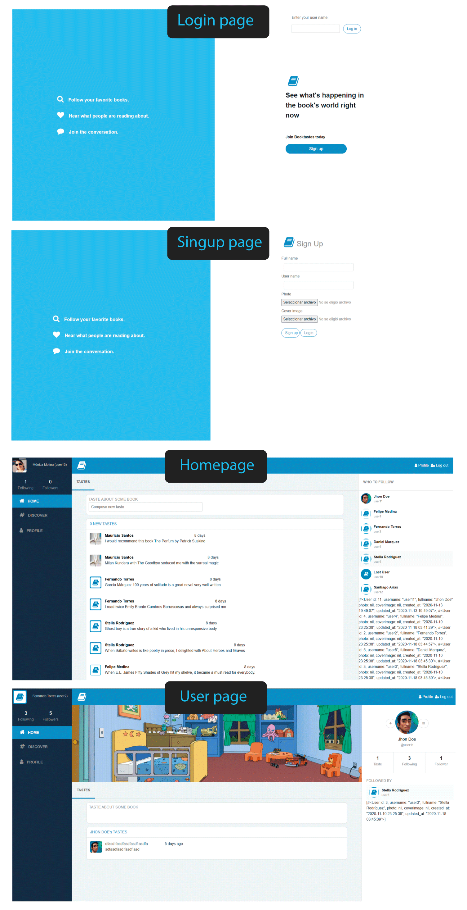

# Twitter Redesign

Capstone Project of the Ruby on Rails Curriculum in Microverse.

The project is about creating an MVP of a Twitter like app with the implementation of the main functionalities.

- Users log in only with username (proper authentication was not a requirement)
  - Before a user logs in they can only see the Log in/Sign up page
  - When they log in they have full access to the app
- Users can create opinions about books which I have called tastes (like tweets)
- Users can follow other users and see what users are following them
- Users can add a profile photo and a profile cover image
  - They can upload those images when signing up 
- User can update all its data in the edit feature

- The app is an MVP of the full product - with the full graphical design, but only basic features that can be extended in the future.


The Live Version - 

Design: [Twitter Redesign](https://www.behance.net/gallery/14286087/Twitter-Redesign-of-UI-details), by [Gregoire Vella](https://www.behance.net/gregoirevella)

## Demo screenshots



## Built With

- Ruby (version 2.6.5p114)
- Ruby on Rails (version 6.0.3.4)
- Gems
 - gem 'pg'
 - gem 'hirb'
 - gem 'bootstrap-sass'
 - gem 'font-awesome-rails'
 - gem 'rspec'
- 

## Usage

Download the repository to your local disk and go to the root directory of app

````
$ git clone https://github.com/maosan132/twitterCapstone.git
$ cd twitterCapstone
````
From the command line, execute next commands:

````
$ bundle install
$ rails db:migrate
````

Should any error messages concerning to bootstrap, try this from command line:
````
$ yarn add bootstrap
````

From command line hit this line to start the rails server then visit: http://localhost:3000 to fire the app
````
$ rails s
````
Run RSpec tests

````
$ rspec
````

## Authors


## 🤝 Contributing

Contributions, issues and feature requests are welcome!


## Show your support

Give a ⭐️ if you like this project!

## Acknowledgments

- [Microverse](https://www.microverse.org/)
